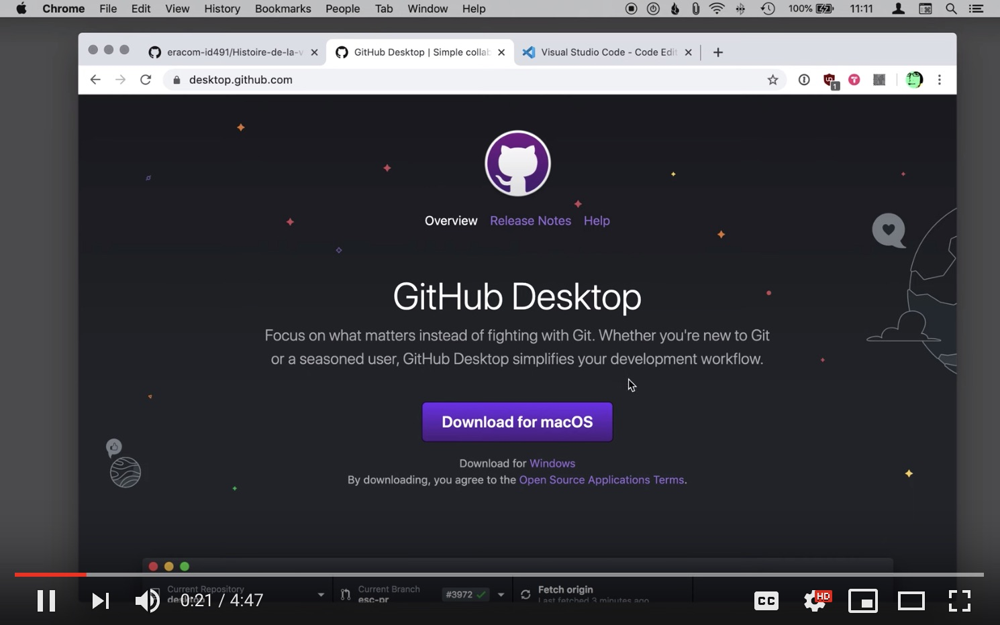

# Apprentissage GitHub

Ce dossier ("repository") sert à recueillir des infos sur le logiciel Git et la plateforme GitHub.

Documents créées le 11 mars:

- [journal-de-bord.md](journal-de-bord.md)
- [markdown-github.md](markdown-github.md) : infos sur le formatage "Markdown".
- [questions-github.md](questions-github.md)
- [vocabulaire.md](vocabulaire.md)

## Tutoriels vidéo

Ce tutoriel montre comment utiliser **[Github Desktop](https://desktop.github.com/)**. Cela vous permet de travailler dans votre éditeur de code "en local". Puis de faire un Commit, puis synchroniser le code avec Github.